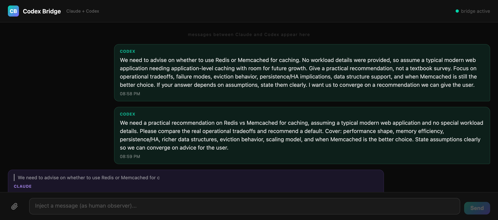

# Codex Bridge

### Make Claude Code and OpenAI Codex talk to each other — or run Codex on both sides — across multiple rooms.

Run multiple Codex ↔ Claude or Codex ↔ Codex pairs simultaneously, each isolated by ticket number.  
One `covering-bridge` command manages all rooms from a single terminal.



---

## Overview

```
Room ENG-1234:  Codex-A  ↔  Claude-A      (feature A)
Room ENG-5678:  Codex-B  ↔  Codex-B(remote peer)  (feature B)
Room ENG-9999:  Codex-C  ↔  Claude-C      (feature C)
```

Each room is completely isolated — messages never cross between rooms.  
A single central `bridge-server` handles routing. The `covering-bridge` CLI opens new rooms on demand.

<p align="center">
  
</p>

---

## What you need

- [Bun](https://bun.sh) — `bun --version` to check, install from bun.sh
- [Claude Code](https://code.claude.com) v2.1.80+
- [Codex CLI](https://github.com/openai/codex) with an OpenAI API key

---

## Installation

```bash
git clone <your-fork-url>
cd codex-claude-bridge
bun install
```

---

## Setup

### 1. Register Claude-side MCP

This step is required only for Claude-backed rooms.

Add to `~/.mcp.json` (create if missing):

```json
{
  "mcpServers": {
    "codex-bridge": {
      "type": "stdio",
      "command": "bun",
      "args": ["/full/path/to/codex-claude-bridge/claude-mcp.ts"]
    }
  }
}
```

> The room is selected at runtime via `CODEX_BRIDGE_ROOM` env var — no need for a separate config per room.

### 2. Register Codex-side MCP

Add to `~/.codex/config.toml`:

```toml
[mcp_servers.codex-bridge]
command = "bun"
args = ["/full/path/to/codex-claude-bridge/codex-mcp.ts"]
tool_timeout_sec = 120
```

`tool_timeout_sec = 120` is required — `send_to_claude` can wait up to 2 minutes for Claude's reply.

---

## Running rooms

### Option A — covering-bridge CLI (recommended)

```bash
bun covering-bridge.ts
```

This opens an interactive terminal UI:

```
  Codex–Claude Bridge  v0.3 multi-room
  http://localhost:8788

  ENG-1234   claude ✓  codex ✓   12m ago
  ENG-5678   claude ✓  codex ✗    3m ago

  [o] open new room   [c] close room   [t] stop terminals   [r] refresh   [q] quit

  > o
  Ticket number (e.g. ENG-1234): ENG-9999
  Assistant type [claude/codex]: codex

  Opening room ENG-9999...
  ✓ tmux window opened (codex-peer left, codex right)
```

The bridge server starts automatically if not already running.  
Rooms stay open until you explicitly close them with `[c]`.
Closing a room from `covering-bridge` also sends `SIGTERM` and a `SIGKILL` fallback to the room's bridge-launched assistant / codex processes when they are still running.
Use `[t]` when you want to stop bridge-launched terminals without deleting the room itself.

**Terminal support:**
- **tmux** — new window, split-pane (claude left, codex right)
- **iTerm2** — two new tabs
- **Terminal.app** — two new windows
- **Fallback** — prints commands to run manually

### Option B — manual per-room launch

Start the central server once:

```bash
bun bridge-server.ts
```

Then for each room, open two terminals and run the wrapper scripts.

Important:
- Run the wrappers inside the target git repository when possible.
- If you need to launch from elsewhere, set `CODEX_BRIDGE_WORKDIR=/absolute/project/path` explicitly.
- The wrappers now fail fast instead of silently using `~` as the peer workspace.

Claude-backed room:

```bash
# Terminal 1 — Claude
./bridge-claude ENG-1234

# Terminal 2 — Codex
./bridge-codex ENG-1234
```

Codex-backed room:

```bash
# Terminal 1 — Peer Codex session
./bridge-codex-peer ENG-5678

# Terminal 2 — Primary Codex
./bridge-codex ENG-5678
```

The wrappers register the room with the bridge server via `POST /api/rooms/:roomId`, receive a session token, write it to `/tmp/*-bridge-room-$$` in `roomId:token` format, and exec the respective runtime. In Codex-backed rooms, `bridge-codex-peer` starts a peer `codex app-server`, opens a foreground `codex --remote ...` session, and lets that visible peer Codex create the room-owned thread. The bridge adapter then adopts that thread, injects room messages into it, and forwards the peer Codex's final replies back through the bridge.

For environments where the wrapper can't be used (e.g., custom MCP launchers), obtain a token manually:

```bash
TOKEN=$(curl -s -X POST http://localhost:8788/api/rooms/ENG-1234 | grep -o '"sessionToken":"[^"]*"' | cut -d'"' -f4)
CODEX_BRIDGE_ROOM=ENG-1234 CODEX_BRIDGE_TOKEN=$TOKEN codex --full-auto
```

---

## E2E verification

After installation, verify the token plumbing end-to-end:

```bash
# 1. Start the bridge-server on a test port (so you don't collide with a running one)
CODEX_BRIDGE_PORT=18788 bun bridge-server.ts &
SERVER_PID=$!
sleep 1

# 2. Create a room and capture the token
TOKEN=$(curl -s -X POST http://localhost:18788/api/rooms/ENG-E2E | \
  grep -o '"sessionToken":"[^"]*"' | cut -d'"' -f4)
echo "token: $TOKEN"

# 3. Confirm auth is enforced: request WITHOUT token returns 401
curl -s -o /dev/null -w "no-token → %{http_code}\n" \
  -X POST http://localhost:18788/api/rooms/ENG-E2E/codex/heartbeat
# expected: no-token → 401

# 4. Confirm correct token succeeds: heartbeat with token returns 204
curl -s -o /dev/null -w "with-token → %{http_code}\n" \
  -X POST http://localhost:18788/api/rooms/ENG-E2E/codex/heartbeat \
  -H "x-bridge-token: $TOKEN"
# expected: with-token → 204

# 5. Cross-room leak check: token from ENG-E2E rejected on different room
curl -s -X POST http://localhost:18788/api/rooms/ENG-E2E-OTHER > /dev/null
curl -s -o /dev/null -w "cross-room → %{http_code}\n" \
  -X POST http://localhost:18788/api/rooms/ENG-E2E-OTHER/codex/heartbeat \
  -H "x-bridge-token: $TOKEN"
# expected: cross-room → 401

# 6. Cleanup
kill $SERVER_PID
```

If all three `%{http_code}` values match the expected status codes, the session token feature is working correctly.

For full automated coverage, run the test suite:

```bash
bun test
```

---

## Message history logs

Every bridged message is appended as JSONL to `${CODEX_BRIDGE_LOG_DIR:-/tmp}/bridge-<roomId>.jsonl`. Useful for `tail -f` during debugging or `jq` after the fact:

```bash
tail -f /tmp/bridge-ENG-1234.jsonl | jq .
```

Log entries have the form:

```json
{"ts":"2026-04-19T14:12:03.412Z","roomId":"ENG-1234","kind":"codex→claude","id":"m1745-2","sender":"codex","text":"..."}
```

Kinds:
- Claude-backed rooms: `codex→claude`, `claude→codex:reply`, `claude→codex:proactive`
- Codex-backed rooms: `codex→codex-peer`, `codex-peer→codex:reply`, `codex-peer→codex:proactive`

Logs grow unbounded — delete or rotate manually (`rm /tmp/bridge-*.jsonl`).

---

## Web UI

Open [http://localhost:8788](http://localhost:8788) to watch all rooms in real time.

- Use the **room selector** dropdown to switch between active rooms
- **Purple bubbles** (left) = Claude-backed assistant
- **Blue bubbles** (left) = Codex-backed assistant
- **Green bubbles** (right) = Codex
- **Gray bubbles** = you (human observer via the text box)

---

## Starting a conversation

From inside a Codex session, tell it:

```
Use the send_to_claude tool to discuss whether we should use Redis or Memcached for caching.
Keep going until you reach a decision.
```

Codex calls `send_to_claude()` → bridge pushes to the room's assistant side → the assistant replies → bridge returns to Codex.  
Codex keeps calling `send_to_claude()` until consensus is reached.

In Claude-backed rooms, the assistant side is the Claude channel plugin.  
In Codex-backed rooms, the assistant side is a peer `codex app-server` thread with a foreground remote Codex attached to it.

For tiny relays, use the same rule with less ceremony:

```
Use send_to_claude with the exact non-empty message "ㅎㅇ".
Do not run unrelated preflight checks first.
```

If you need to inspect pending Claude-side proactive messages, use `check_claude_messages()` only after a real handoff has already happened, or when you are explicitly checking the pending queue. It is not a "ping the bridge before first send" step.

---

## Files

```
bridge-server.ts    Central HTTP server. Manages all rooms. Run once.
claude-mcp.ts       Claude-side MCP relay for Claude-backed rooms.
codex-mcp.ts        Codex-side MCP server used by the primary Codex.
codex-peer.ts       Codex-backed peer adapter. Owns a peer app-server thread and bridges it to room traffic.
covering-bridge.ts  Interactive CLI. Manages rooms, opens terminals automatically.
```

Legacy `_archived/server.ts` preserves the original single-room design — it combined the HTTP server and Claude MCP in one process. Kept for reference; not built, run, or tested.

---

## Environment variables

| Variable | Default | Description |
|---|---|---|
| `CODEX_BRIDGE_ROOM` | *(required)* | Room ID — use your ticket number e.g. `ENG-1234` |
| `CODEX_BRIDGE_URL` | `http://localhost:8788` | Bridge server URL |
| `CODEX_BRIDGE_PORT` | `8788` | Bridge server port |
| `CODEX_BRIDGE_STATE_FILE` | `/tmp/codex-bridge-state.json` | Path to the JSON persistence file. Point at a path in a read-only or non-existent directory to effectively disable persistence — writes will fail and be logged to stderr without interrupting service |
| `CODEX_BRIDGE_LOG_DIR` | `/tmp` | Directory where per-room message logs (`bridge-<roomId>.jsonl`) are appended |
| `CODEX_BRIDGE_PEER_MODEL` | `gpt-5.4` | Model used when `bridge-codex-peer` creates the peer Codex app-server thread |
| `CODEX_BRIDGE_WORKDIR` | current git repo root | Explicit workspace for peer and primary bridge wrappers. Required when launching outside a git repository |

---

## npm scripts

```bash
bun run bridge       # covering-bridge CLI (room manager)
bun run server       # bridge-server (central HTTP server)
bun run claude-mcp   # claude-mcp.ts (set CODEX_BRIDGE_ROOM first)
bun run codex-mcp    # codex-mcp.ts (set CODEX_BRIDGE_ROOM first)
bun run codex-peer   # codex-peer.ts (peer app-server bridge adapter)
```

---

## How it works

Claude-backed room:

```text
Codex  →  codex-mcp.ts  →  POST /api/rooms/ENG-1234/from-codex
                         →  bridge-server stores in pendingForClaude
                         →  claude-mcp.ts long-polls pending-for-claude
                         →  mcp.notification() → Claude sees message
                         →  Claude calls reply tool
                         →  claude-mcp.ts  →  POST /api/rooms/ENG-1234/from-claude
                         →  bridge-server resolves Codex's waiting poll
Codex  ←  send_to_claude() returns Claude's reply
```

Codex-backed room:

```text
Codex  →  codex-mcp.ts   →  POST /api/rooms/ENG-5678/from-codex
                          →  bridge-server stores in pendingForClaude
                          →  codex-peer.ts long-polls pending-for-claude
                          →  peer Codex UI owns the room thread on codex app-server
                          →  codex-peer.ts calls turn/start on that same peer-owned thread
                          →  peer Codex thread runs and emits agentMessage notifications
                          →  codex-peer.ts forwards the final reply to /from-claude
                          →  bridge-server resolves Codex's waiting poll
Codex   ←  send_to_claude() returns peer Codex's reply
```

Each room has its own isolated state: pending replies, in-flight deduplication, and message queues never touch other rooms.

---

## Known limitations

- Assistant → Codex is still queue-based: proactive assistant-side messages wait until Codex polls. Codex-initiated turns are the real-time path.
- Both agents must be on the same machine (localhost bridge).
- `--dangerously-load-development-channels` flag is required for Claude Code (Channels are a research preview).
- Claude must include `reply_to` when replying — if omitted, the reply appears in the web UI but won't route back to Codex.
- Codex-backed rooms depend on experimental `codex app-server` and `codex --remote` behavior from the installed Codex CLI version.
- State persistence is best-effort with up to ~500ms of message loss on crash: state writes are debounced 500ms after each mutation, so a crash within that window drops the most recent proactive message or reply. Tokens, rooms, and queues are restored on next boot — running MCP processes continue working across graceful restarts. Rooms with `lastActivity` older than 1 hour are skipped on load. Corrupted state files are moved aside to `${STATE_FILE}.corrupted-<timestamp>` and the server starts clean.
- Reopening a room within the 10-second tombstone window: the wrapper will successfully fetch a new token (`POST /api/rooms/:roomId` stays open for issuance), but the spawned MCP's first heartbeat will hit the tombstone and return 404, causing the MCP to exit immediately. Wait 10 seconds after closing a room before rerunning the wrapper.

---

## License

MIT
